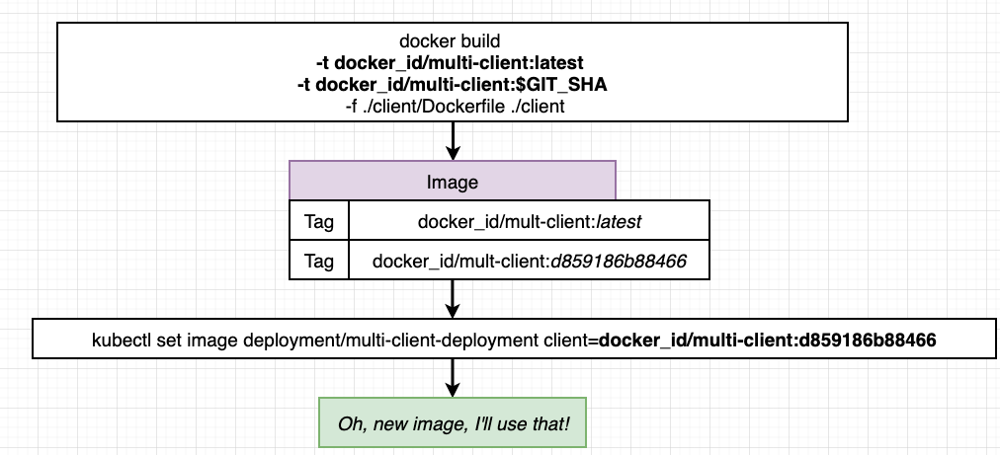

# Project overview
[this is a copy of the project this project](https://github.com/Abdelgo/Docker_Kubernetes/tree/master/multi-container_K8s_project) adapted to run on GCP Kubernetes cluster
# App configuration to Deploy it on Google K8s cluster !


# Tools
> Docker
> Travis for CI/CD
> Kubernetes

# Platform
> Google Cloud Kubernetes Cluster

# 1. Create A Kubernetes Cluster (see GCP)
> Standard - Zonal - version latest
> on IAM Admin > service Account > create service account > Role: Kuberntes Engine Admin (or else)  
> then Manage keys > create new key json format  

### 1.1 Encrypting service account file (json)
this json must encrypted to be passed to Travis, the encryption will be done by Travis CLI :  
https://docs.travis-ci.com/user/encrypting-files/

**When you encrypt the file, you must pass the same --com or --pro flag you used to log in**
```shell
travis encrypt-file service-account.json -r USERNAME/REPO --com
``` 
or  
```shell
travis encrypt-file service-account.json -r USERNAME/REPO --pro
```

**Remark**  
In case of you don't have ruby installed you can use a docker container to use Travis CLI
 

# 2. Travis Configuration steps: 

  

# 2.1 Travis Yaml File

```YAML
sudo: required
services:
  - docker
env:
  global:
    - SHA=$(git rev-parse HEAD) # to get the revision
    - CLOUDSDK_CORE_DISABLE_PROMPTS=1 # disable any prompt from google SDK
before_install:
  - openssl aes-256-cbc -K $encrypted_9f3b5599b056_key -iv $encrypted_9f3b5599b056_iv -in service-account.json.enc -out service-account.json -d # decryption to get the service-account.json to be placed in our root project directory
  - curl https://sdk.cloud.google.com | bash > /dev/null; # download the SDK inside /dev/null
  - source $HOME/google-cloud-sdk/path.bash.inc # execute the path.bash.inc
  - gcloud components update kubectl # update Kubectl
  - gcloud auth activate-service-account --key-file service-account.json # authenticate to the GCP account
  - gcloud config set project steady-petal-307322 # select the project ID
  - gcloud config set compute/zone us-central1-c # the zone of the kubernetes ressource
  - gcloud container clusters get-credentials multi-cluster # name of the kubernetes cluster
  - echo "$DOCKER_PASSWORD" | docker login -u "$DOCKER_USERNAME" --password-stdin # connect to docker account (env var)
  - docker build -t stephengrider/react-test -f ./client/Dockerfile.dev ./client # build the client image in github repo to use it for test

script:
  - docker run -e CI=true stephengrider/react-test npm test # run the tests

deploy: # as there is no built in deploy for Kubernetes, we use a script
  provider: script
  script: bash ./deploy.sh # execute this script
  on:
    branch: master # only if push is from master branch
```


### 2.2 deploy.sh

```shell
# building the images with 2 tags latest and git sha for reference and debugging purpose
docker build -t cygnetops/multi-client-k8s:latest -t cygnetops/multi-client-k8s:$SHA -f ./client/Dockerfile ./client
docker build -t cygnetops/multi-server-k8s-pgfix:latest -t cygnetops/multi-server-k8s-pgfix:$SHA -f ./server/Dockerfile ./server
docker build -t cygnetops/multi-worker-k8s:latest -t cygnetops/multi-worker-k8s:$SHA -f ./worker/Dockerfile ./worker

#pushing images to docker hub
docker push cygnetops/multi-client-k8s:latest
docker push cygnetops/multi-server-k8s-pgfix:latest
docker push cygnetops/multi-worker-k8s:latest

docker push cygnetops/multi-client-k8s:$SHA
docker push cygnetops/multi-server-k8s-pgfix:$SHA
docker push cygnetops/multi-worker-k8s:$SHA

# applying kubernetes config files in the k8s folder
kubectl apply -f k8s
# updating docker images used to the latest git sha deployed
# kubectl set image <object-type>/deployment-name(from deploymnent yaml >metadata/name) 
# -suite-- <container-name>(from dployment yaml file >spec/spec/containers/name)=dockerhubname/dockerimage
kubectl set image deployments/server-deployment server=cygnetops/multi-server-k8s-pgfix:$SHA
kubectl set image deployments/client-deployment client=cygnetops/multi-client-k8s:$SHA
kubectl set image deployments/worker-deployment worker=cygnetops/multi-worker-k8s:$SHA
# all images has been updated
```
see :  

  

# 3. configuring the Kubernetes cluster
### 3.1 General
> 1 - Select the project
> 2 - open the shell and type the following commands

```shell
gcloud config set project steady-petal-307322 # select the project ID
gcloud config set compute/zone us-central1-c # the zone of the kubernetes ressource
gcloud container clusters get-credentials multi-cluster # name of the kubernetes cluster
```
### 3.2 create a secret password
> create a secret password for Postgress database
```linux
kubectl create secret generic pgpassword --from-literal PGPASSWORD=easypass
```

### 3.3 install Ingress-Nginx
for this we will use Helm which is a package manager for kubernetes  

**so to get helm you run :**  
```shell
$ curl -fsSL -o get_helm.sh https://raw.githubusercontent.com/helm/helm/master/scripts/get-helm-3
$ chmod 700 get_helm.sh
$ ./get_helm.sh
```
ressource: https://helm.sh/docs/intro/install/#from-script

**then to install Ingress-Nginx you run :**  
```shell
helm repo add ingress-nginx https://kubernetes.github.io/ingress-nginx
helm repo update

helm install ingress-nginx ingress-nginx/ingress-nginx
```
ressource: https://kubernetes.github.io/ingress-nginx/deploy/#using-helm

**check the Network services**  
you should see a google cloud LoadBalancer instance created that controls the access to the 3 nodes inside our cluster  


# 4. Deployment
after running a git push verify that :  
> Travis ok  
> you have all the deployments on Kuberntes / worloads
> you have all the services on Kuberntes / services  
> you have the Ingress service with all the paths configured on Kuberntes / services  
> you have the configmaps and secret on kubernetes / configurations  
> you have PVC on kubernetes / storage  

> visit the webpage and see the result  

# 5. Update in production workflow
  