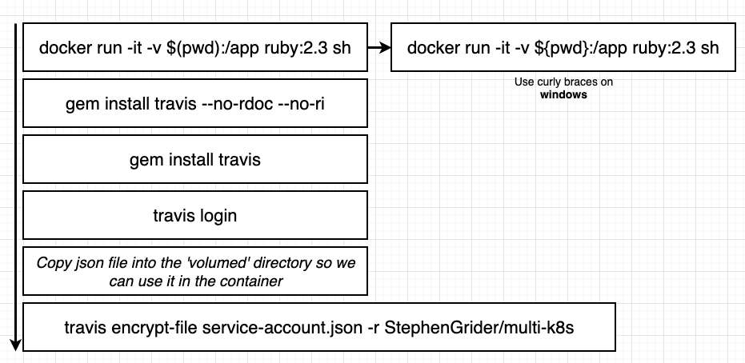

# Project overview
[This project is a copy of Multi-container-App deployed on AWS](../Multi-container-App-deployed_on_AWS_BS) that will be adapted to work in the K8s.

  

will be   
   
PVC: Persistent Volume Claim
for this project we will not need the following folder: 
- nginx : as the routing will be done Ingress Service with the outside world

also we don't need the following files :

> docker-compose.yml  
> Dockerrun.aws.json  
> .travis.yml  


# Objects Used in this project:


we will use deployments to create the needed pods

## 1. Services used
**Note** a service is needed when we have a request into a set of pods (or a single pod), so for the worker there is no need to have a ClusterIP neither a port setting  
there is no information inside the worker than need to be accessible from anything else inside our cluster
### 1.1 ClusterIP
the ClusterIP exposes a set of pods to other objects in the cluster  


### 1.2 Ingress Service
Ingress exposes HTTP and HTTPS routes from outside the cluster to services within the cluster. Traffic routing is controlled by rules defined on the Ingress resource  
  
### 1.2.1 Ingress implementations
Kubernetes as a project supports and maintains [AWS](https://github.com/kubernetes-sigs/aws-load-balancer-controller#readme), [GCE](https://github.com/kubernetes/ingress-gce), and [nginx](https://github.com/kubernetes/ingress-nginx/blob/main/README.md#readme) ingress controllers.  

there are  multiple implementation of Ingress, for this project we will use **Nginx Ingress**  
   
  


### 1.2.2 Ingress behind the scene
Ingress need to be considered as the deployment object for services, see the analogy below
  
- 1 - create a config file with the routing rules (yaml file)
- 2 - execute kubectl apply -f (yaml file) : this will create the Ingress controller
- 3 - the ingress controller will look at the desired state and create the infrastructure (Nginx pod) to meet the desired state  
the philosophy is :


**When creating Ingress-Nginx on Google Cloud** here below what happens:  
  
when creating an Ingress-Nginx service, (the Ingress controller will create the Nginx pod) in the same pod

**Installation guide Ingress-Nginx**
- 1. Execute the provider-specific command noted here:

https://kubernetes.github.io/ingress-nginx/deploy/#docker-desktop

- 2. Verify the service was enabled by running the following:

kubectl get pods -n ingress-nginx

It should show something similar:
get pods -n ingress-nginx
|NAME |READY |  STATUS   |   RESTARTS  | AGE|  
|---|---|---|---|---|  
|ingress-nginx-admission-create-499cn    |   0/1    | Completed |  0    |      79s|  
|ingress-nginx-admission-patch-667p4     |   0/1   |  Completed  | 2    |      79s|  
|ingress-nginx-controller-86d99778d-gxvnh  | 1/1    | Running     |0         | 80s|  

- 3. create Ingress configuration


### 1.3 Load Balancer
A load balancer is a service that allows access to one specific set of pods, so very important, a load balancer cannot give access to more than one set of pods, this is why it will be not used in our project as we have 2 sets of pods (multi-client and multi-server) that needs to be connected to the outside world  
  
so when using Load balancer service, kubernetes will also reach out to the cloud provider (AWS, GCP..) and it will use their configuration (or definition) of what a LoadBalancer is, then the cloud provider will set up a load balancer ressouce outside of K8s cluster and it will configure it automatically to send traffic into the K8s cluster and access the LoadBalancer Service that is set up to governe a set of pods.  

## creating object
> 1. Create a folder K8s where you store all the config yaml files
> 2. open the shell and go to the project directory an type :  
shell > kubectl apply -f K8s

## 2. Databases pods 
### Postgres and necessity of Volumes
 
the necessity of volumes comes from the fact that when a postgress pod is created, it will contain a postgress container which by itself contain the data stored, so if the container crushes the data will be lost
 
here comes the volumes :  
  

when a container crushes depoyment>pod will create a new one that will be connected  to the volume to get the data.  
  

# Types Volumes in Kubernetes


## 1. volumes in K8s
   

> A volume still at the pod level, so if the pod crushes we lose our data !  

## 2. Persistent volumes
A persistent volume is a long term durable storage, so if a pod crushes we will not lose data  

### Persistent volume claim
is a request for storage by a user. It is similar to a Pod. Pods consume node resources and PVCs consume PV resources. Pods can request specific levels of resources (CPU and Memory). Claims can request specific size and access modes (e.g., they can be mounted ReadWriteOnce, ReadOnlyMany or ReadWriteMany, [see AccessModes](https://kubernetes.io/docs/concepts/storage/persistent-volumes/#access-modes))


PVC is like saying to kubernetes : I want a storage that meets the requirment explained in the PVC yaml file (see example below) :  

```YAML
apiVersion: v1
kind: PersistentVolumeClaim
metadata:
  name: database-persistent-volume-claim
spec:
  accessModes:
    - ReadWriteOnce
  resources:
    requests:
      storage: 2Gi
      # storageClassName needed to be specified if we use a cloud provider
```


### Designating a PVC in a pod template
As described before we want a persistent storage to be dedicated to postgress pod, for this we need to update the yaml config file of the postgress deployment:  

```YAML
apiVersion: apps/v1
kind: Deployment
metadata:
  name: postgres-deployment
spec:
  replicas: 1
  selector:
    matchLabels:
      component: postgres
  template:
    metadata:
      labels:
        component: postgres
    spec:
      volumes: # here we specify that we need a persistent storage as described in the claim
        - name: postgres-storage
          persistentVolumeClaim:
            claimName: database-persistent-volume-claim # we give the claim name
      containers:
        - name: postgres
          image: postgres
          ports:
            - containerPort: 5432
          volumeMounts: # describe how the storage will be used inside the container (like docker volume)
            - name: postgres-storage #we specify the volumename that must be used-see volumes section
              mountPath: /var/lib/postgresql/data # here the path inside the container from where we  store the content inside the persistent storage (the data that we want to backup )
              subPath: postgres # the name of the folder inside the persistent storage where this data will be stored
```

for more details please visit : https://kubernetes.io/docs/concepts/storage/persistent-volumes/

**get infos about pv**

> kubectl get pv (list all the pv created inside our application, list the instance of storage that meets requirment pvc)


kubectl get pv
|NAME|CAPACITY|ACCESS MODES|RECLAIM POLICY|STATUS|CLAIM|STORAGECLASS|REASON|AGE|  
|---|---|---|---|---|---|---|---|---|  
|pvc-4ad12b40-985a-4e16-9dc6-e6dec7a7d91c|1Gi|RWO|Delete|Bound|default/database-persistent-volume-claim|hostpath|47m|  

> kubectl get pvc (list all the claims) 

## Environment Variables


**Objectives:** 
- permit to the multi-worker pod to connect to Redis DB
- permit to the multi-server pods to connect to Redis DB and Postgress DB

**Solution:** 
we need to specify the information needed for each type of DB as described below :  
 / 
Red: Are the hosts link
Yellow: databases informations
White : is postgress password ( see section Secret Variables)

**Method :** in the yaml config files we add environment variables in the client side which means in:  
- multi-worker deployment
- multi-server deployment  
example of worker:  
```YAML
apiVersion: apps/v1
kind: Deployment
metadata:
  name: worker-deployment
spec:
  replicas: 1
  selector:
    matchLabels:
      component: worker
  template:
    metadata:
      labels:
        component: worker
    spec:
      containers:
        - name: worker
          image: stephengrider/multi-worker
          env:
            - name: REDIS_HOST # name of the env variable
              value: redis-cluster-ip-service # specify the CLusterIP responsible to communicate with redis pod
            - name: REDIS_PORT # port
              value: '6379' # default port used by redis (same value used also for redis ClusterIP)
```

## Secrets

[kubernetes Secrets section](https://kubernetes.io/fr/docs/concepts/configuration/secret/)

secret is an object that can configured with yaml config file, but in that case our passwords will be visible, therefore we use a **Imperative approach** see instruction below :

   

> kubectl create secret generic pgpassword --from-literal PGPASSWORD=easypass
  

secret/pgpassword created

### Passing secrets as environment variables
```YAML
apiVersion: apps/v1
kind: Deployment
metadata:
  name: server-deployment
spec:
  replicas: 3
  selector:
    matchLabels:
      component: server
  template:
    metadata:
      labels:
        component: server
    spec:
      containers:
        - name: server
          image: cygnetops/multi-server-pgfix-5-11
          ports:
            - containerPort: 5000
          env:
            - name: REDIS_HOST
              value: redis-cluster-ip-service
            - name: REDIS_PORT
              value: '6379' # redis default port (must be between quotes as string)
            - name: PGUSER
              value: postgres # by default PGUSER
            - name: PGHOST
              value: postgres-cluster-ip-service # ClusterIP of postgres pod
            - name: PGPORT 
              value: '5432' # postgres default port (must be between quotes as string)
            - name: PGDATABASE 
              value: postgres  # default postgres database 
            - name: PGPASSWORD # name of the variable 
              valueFrom:
                secretKeyRef:
                  name: pgpassword # the secret name created
                  key: PGPASSWORD # the secret key created
```

[secrets and config map article](https://medium.com/@xcoulon/managing-pod-configuration-using-configmaps-and-secrets-in-kubernetes-93a2de9449be)
